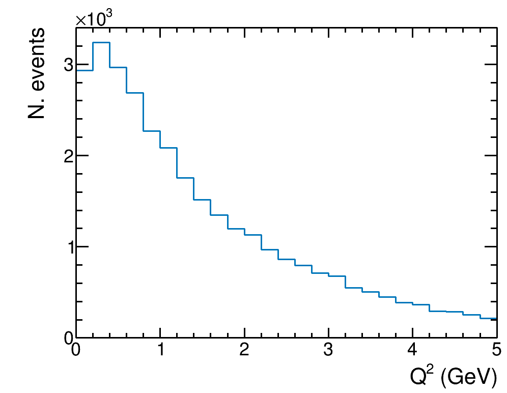
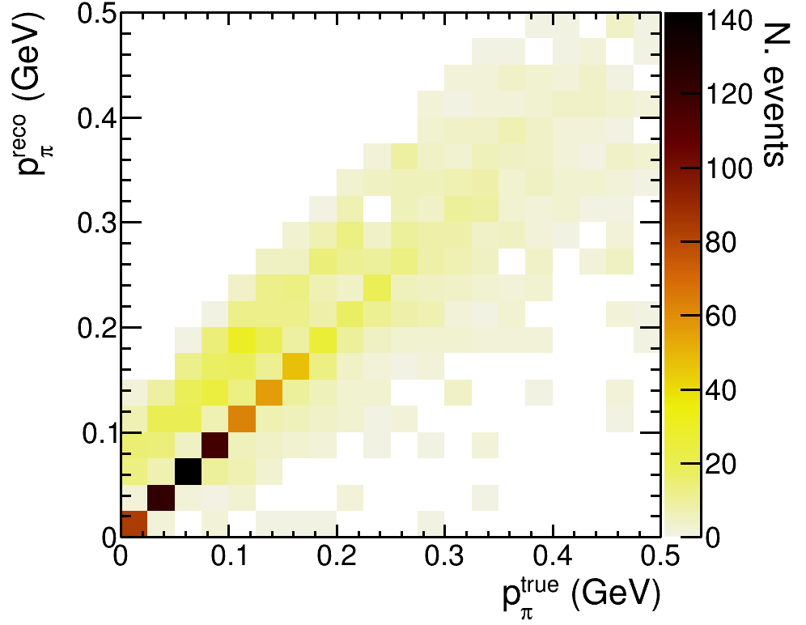

# 2x2_truth_studies

## Building and using the containers/software
For anybody comfortable with building and using containers, this section can largely be skipped.

### Singularity

Instructions for installing singularity on Linux can be found here: https://sylabs.io/guides/3.10/admin-guide/installation.html

I tested the build recipes on Ubuntu 22.04 with singularity version 3.10.2, although any version newer than 3.6.3 should be fine, and it shouldn't depend on the Linux OS.

There are instructions on how to run singularity on Mac/Windows, with the added hassle of doing it through a VM. Alternatively, there are docker images with the same contents available (see "Obtaining ready-made containers"). Note, however, that no instructions for running docker containers with the docker runtime environment will be provided... life is far too short. But in principle you should be able to run the same commands in the docker container once you deal with any directory mounting/X11 issues.

#### Building singularity containers
Singularity containers are built with a command like:
```
sudo singularity build images/<container.sif> <recipe.def>
```
Strictly speaking, the images directory isn't necessary. Note that you need to have root privileges and internet access when building (but not running) the containers.

Note that there are two .def files, the first containers ROOT and some other basics, the second builds from the first and adds in GENIE, edep-sim, GEANT4, etc etc:
* root_v6.14.06_pythia6.def
* 2x2_sim_prod.def

If you want to, you can also just take the commands in the .def files as a basis for building software locally. Or port it to a different container build system.

#### Obtaining ready-made containers
The simplest way to obtain the containers is through NERSC, you can download the (4GB) final container with:
```
wget https://portal.nersc.gov/project/dune/data/2x2/images/2x2_sim_prod.sif
```
(The intermediate ROOT container is in the same directory)

Alternatively, if you want to use docker containers, you can pull them down from dockerhub: wilkinsonnu/nuisance_project:2x2_sim_prod

You could even, if you were so inclined, pull from the dockerhub repo and run commands through the singularity runtime environment:
```
singularity exec docker://wilkinsonnu/nuisance_project:2x2_sim_prod <your command>
```
(It will cache the image so only the first such command would download the large file)

Finally, if you have access to NERSC machines, you can run the docker containers, through shifter (an alternative container runtime environment) with:
```
shifter -V ${PWD}:/output --entrypoint --image=docker:wilkinsonnu/nuisance_project:2x2_sim_prod <your command>
```


#### Running singularity containers
Singularity is pretty easy to use, if you want to run something in the container, you can simply run it like:
```
singularity exec </path/to/my_container.sif> <The same command you would have given locally>
```
Additionally, you can open up the container and poke around in it with:
```
singularity shell </path/to/my_container.sif>
```
This will open a new shell inside the container. Note that you cannot modify the contents of the container, **but** you can modify your host system!

## Generating/obtaining simulation files
This section describes how to generate events in a complex geometry using GENIE and simulating their energy deposition using GEANT4 wrapped in edep-sim. Both GENIE and edep-sim have extensive documentation of their own and anything not covered in this "quickstart guide" can probably be found there.

### Generating files
This step is primarily included here for documentation purposes, and to allow users of the files to understand how the files are generated, and the inputs/assumptions required.

An example script detailing the technical steps is given in `example_generation_script.sh`. This relies on a number of inputs:
- A .gdml file describing the geometry to be simulated (this example is for the 2x2+MINERvA, but it could be anything)
- A description of the incoming neutrino beam 
  - Here, "dk2nu" files are used (see https://github.com/DUNE/fnal-nutools/tree/master/dk2nu), but GENIE provides support for many other inputs. Note that for non-FNAL applications, one might need to use `gevgen` instead of `gevgen_fnal` (see the GENIE docs)
  - These files are produced with `G4NuMI`, and are common for all experiments in the NuMI beamline (e.g., NOvA and MINERvA could use the same files)
  - The example used here `g4numiv6_minervame_me000z200i_0_0001.dk2nu` was generated for NOvA. It is downloaded from NERSC in the script because it is too large for github 🚱
- `GNuMIFlux.xml` describes the relationship between the co-ordinate system used for the detector geometry and the beamline (ued to make the dk2nu file). Additionally, it defines a "region of interest" to avoid simulating neutrinos which don't pass anywhere near the geometry
- A set of GENIE splines in `G18_10a_02_11a_FNALsmall.xml`. These are very slow to calculate, and are used to make event generation significantly more efficient. These are also downloaded from NERSC in the script because they are too large for github 🦖
- A file setting various parameters to use in the GEANT4 simulation: `2x2_beam.mac`

As an aside, I included an example geometry viewing script so it is easy to inspect the geometry (with ROOT) that is being used here. The script is largely borrowed from Clarence Wret, but I'm sure he won't mind it being shared.
```
singularity exec images/2x2_sim_prod.sif root -ql 'inspectgeom.C("inputs/Merged2x2MINERvA_noRock.gdml")'
```
(Note that this shouldn't depend on anything except ROOT, so there's no need to use the version in the container)

The basic generation steps are:
- Calculate the maximum interaction probability for a neutrino passing through this detector -- GENIE's `gmxpl` tool.
  - This step is rather slow, but can be re-used as long as the geometry doesn't change
- Generate primary vertices throughout the detector geometry -- GENIE's `gevgen_fnal` tool
- Convert the GENIE (GHEP) output to the "rootracker" format required by edep-sim -- GENIE's `gntpc` tool
- "Cherrypick" (select) events where the primary (GENIE) vertex is within the 2x2 active volume -- custom `cherrypicker.py` script
  - This is not a necessary step, but the subsequent steps are more computationally intensive, so it's advantageous to focus on the events we are interested in for most truth-level studies
  - (Cuts the number of events by a factor of 10)
- Run GEANT4 through edep-sim to simulate the energy depositions and re-interactions of particles produced by the GENIE vertices, as they propagate through the geometry provided.
  - Note that only those volumes inside the geometry identified with a `SensDet` tag have energy deposits saved

Further comments are given in the example generation script.

### Obtaining pre-generated files
Note that this step is also unnecessary, and a large number of files made in the same way as the example provided here are provided at: https://portal.nersc.gov/project/dune/data/2x2/simulation/edepsim/

E.g., to get a single FHC file, generated in the same way as described in the example script:
```
wget https://portal.nersc.gov/project/dune/data/2x2/simulation/edepsim/NuMI_FHC_CHERRY/Merged2x2MINERvA_noRock_NuMI_FHC_CHERRY_5E17_000_EDEPSIM.root	
```
200 files are currently provided in both FHC and RHC, corresponding to 1E20 (equivalent to ~1 month of NuMI running), although it's very easy to produce more on request.

Also note that if you have a NERSC account, you can copy files much more easily to another location. All files publicly accessible under: `https://github.com/wilkinson-nu/2x2_truth_studies.git` can be found under `/project/projectdirs/dune/www/data/2x2/` from a NERSC machine.

## Analyzing the edep-sim output files

### Using the edep-sim event display
As a first step, it can be useful to visualize what is going on in an event. For just such a purpose, edep-sim provides an event display which can be used to view an edep-sim output file:
```
singularity exec images/2x2_sim_prod.sif edep-disp -s volLArActive -s DetectorlvTower -s volCryostatInnerBath_OuterTubTorusInnerTub <input_file>
```
The slightly cryptic -s arguments tell edep-sim which parts of the detector geometry to show. To keep rendering times short, only the larger volumes are shown, to provide a basic sketch of the detector layout with respect to the hits. Note that hits in all volumes are drawn. Basic event display functions are pretty self-explanatory, but for further details on what you can do with it, look at the edep-sim documentation.

### Running a simple script to calculate containment
The structure of the edep-sim output file is described here: https://github.com/ClarkMcGrew/edep-sim/blob/master/io/TG4Event.h

An example script for analyzing the edep-sim output is given: `example_analysis.py`. Which can be run:
```
singularity exec images/2x2_sim_prod.sif python3 example_analysis.py <input_edepsim_file.root>
```
Note that whilst you can get some mileage out of looking at the edep-sim output file with a TBrowser, you will run into issues because the entries are saved in custom `TG4Event` objects. The (Py)ROOT version in the container picks up on the necessary objects from edep-sim to understand these. It may be possible to access some or al of the objects through PyROOT without the edep-sim library... but the example script uses class-specific getters so requires it.

The source code for `example_analysis.py` is heavily commented, and hopefully touches on most of the types of information one might need. In brief, it makes a CC-inclusive selection, looks for the hadronic system to be contained within the 2x2 active volume, and requires (very roughly) that the muon exits out the back of MINERvA, and therefore could be tagged as a muon.

The total number of events in the files passed to `example_analysis.py` is shown as a function of true Q<sup>2</sup> in `plots/example_ccinc_q2.png`.


The fraction of CC-inclusive events contained is shown as a function of true Q<sup>2</sup> in `plots/example_ccinc_q2_2x2cont.png`.


Finally, the relationship between the total energy deposited in the detector and true kinetic energy is shown for all charged pions in the CC-incusive sample in `plots/example_pi_erec_2x2cont.png`.


Note that these examples are just chosen to use different parts of the edep-sim output (GENIE pass through, true info, energy deposits, etc...), rather than because they're particularly interesting.
